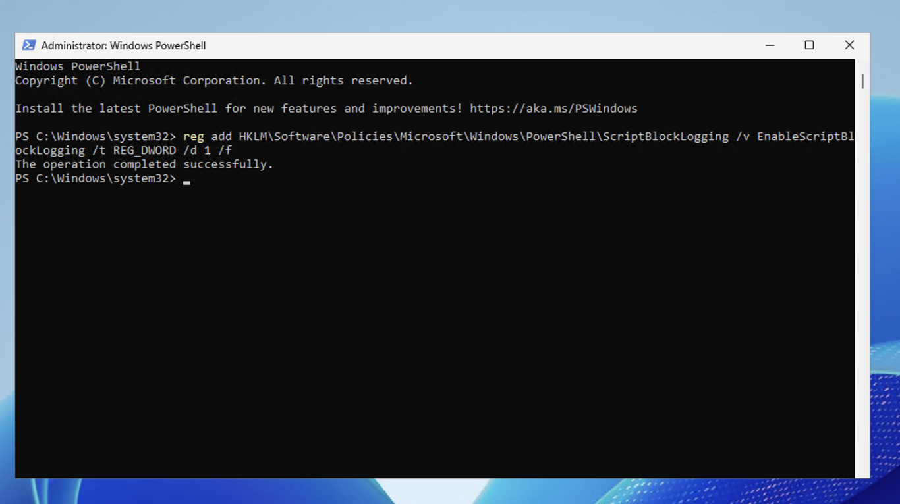

# Day 4 – Detection Validation

## Objective

The purpose of this phase was to verify that the custom Wazuh detection rule generated security alerts for simulated PowerShell-based process discovery activity.

By validating these alerts, we confirm that Wazuh is successfully collecting logs, analyzing PowerShell activity, and detecting suspicious behavior on the monitored Windows endpoint.

---

## Validation Process

After configuring the custom detection rule, a PowerShell command was executed on the Windows endpoint to simulate attacker behavior.

The Wazuh dashboard was then used to confirm that a security alert was generated for this activity.

The alert was reviewed within the **Security Events** section of the Wazuh dashboard.

Key alert details validated during this process included:

- Rule ID  
- Alert description  
- Source endpoint  
- PowerShell command executed  
- Alert severity level  
- Parent rule correlation  

---

## Validation Results

The following activity was successfully detected by Wazuh:

| Attack Simulation | Command | Detection Status |
|---|---|---|
| PowerShell Process Discovery | `powershell -nop -c "Get-Process"` | Detected |

This result confirms that the custom detection rule successfully identified PowerShell-based activity.

---

## Screenshot Evidence

### PowerShell Logging Enabled

PowerShell Script Block Logging was enabled on the Windows endpoint.

Screenshot:

---

### Attack Execution

The PowerShell command used to simulate process discovery activity.

Screenshot:

---

### Event Ingestion

Wazuh detected the PowerShell activity using the built-in rule.

Screenshot:

---

### Custom Rule Detection

Wazuh triggered the custom rule `100002` based on the PowerShell activity.

Screenshot:

---

### Alert Details

The alert details confirm the detection and rule correlation.

Screenshot:

---

### Custom Rule Configuration

The custom rule defined in `local_rules.xml`.

Screenshot:

---

## Conclusion

The validation phase confirmed that the custom Wazuh detection rule successfully detected PowerShell process discovery activity.

This demonstrates how a Security Operations Center can monitor PowerShell activity and detect potential threats using SIEM-based alerting and custom detection rules.
