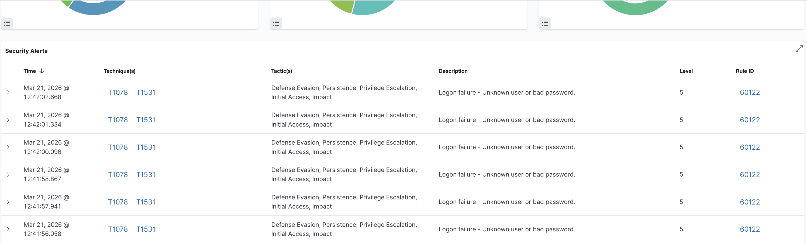
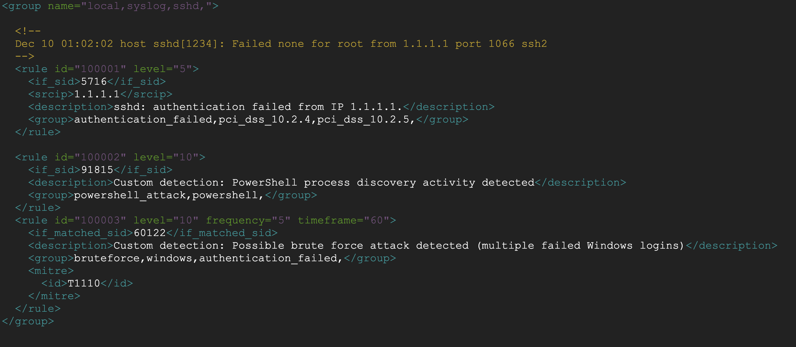
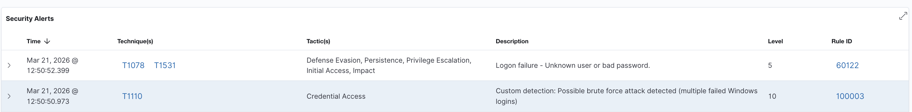
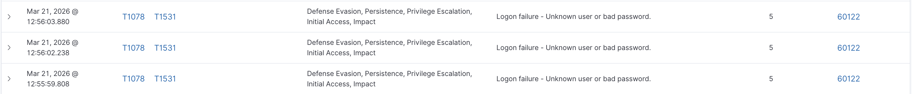

# Day 6 – Validation

## Validation Objective

Verify that the custom Wazuh detection rule correctly identifies brute force attacks while avoiding false positives.

---

## Validation Approach

Two scenarios were tested:

1. **Negative Test (Below Threshold)**
   - Simulated fewer than 5 failed login attempts
   - Expected result: No brute force alert

2. **Positive Test (Above Threshold)**
   - Simulated 5 or more failed login attempts within 60 seconds
   - Expected result: Custom brute force alert triggered

---

## Test Case 1 – Below Threshold (3 Failed Attempts)

### Steps

1. Locked Windows system using `Win + L`
2. Entered incorrect password for account `sega` 3 times
3. Observed alerts in Wazuh dashboard

### Expected Result

- Only individual failed login alerts (Rule 60122)
- No custom brute force alert (Rule 100003)

### Observed Result

- Wazuh generated individual authentication failure alerts
- No brute force detection rule was triggered

---

## Test Case 2 – Above Threshold (Brute Force Simulation)

### Steps

1. Locked Windows system using `Win + L`
2. Entered incorrect password for account `sega` 6–10 times within 60 seconds
3. Observed alerts in Wazuh dashboard

### Expected Result

- Custom brute force alert triggered
- Rule ID: 100003
- Alert Level: 10 (High)

### Observed Result

- Wazuh successfully triggered the custom brute force detection rule
- Multiple failed login events were correlated into a single alert

---

## Evidence

### Before Correlation – Multiple Failed Login Alerts

---

### Custom Rule Configuration

---

### After Correlation – Brute Force Detection Alert

---

### Threshold Validation – No Alert Triggered

---

## Result

Validation successful.

The custom rule:

- Correctly detects brute force attacks when threshold conditions are met
- Does not trigger on normal or low-volume failed login attempts
- Reduces alert noise by correlating multiple events into a single meaningful alert

---

## Analyst Conclusion

The implementation of event correlation significantly improves detection quality by transforming multiple low-level alerts into a single high-confidence brute force detection.

This approach enhances SOC efficiency by reducing alert fatigue and enabling faster identification of credential-based attacks.
