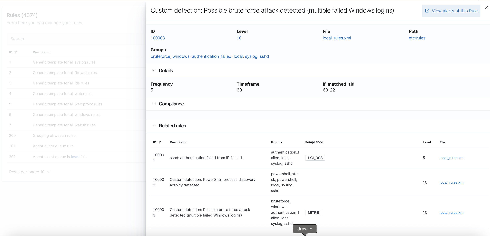
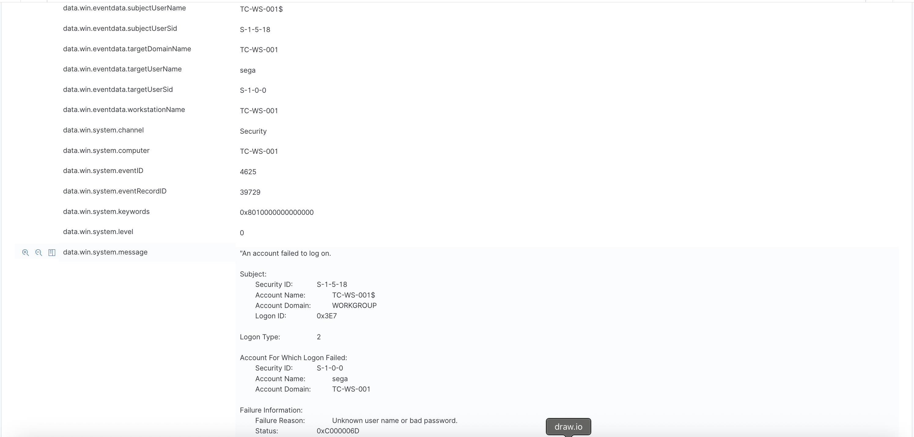
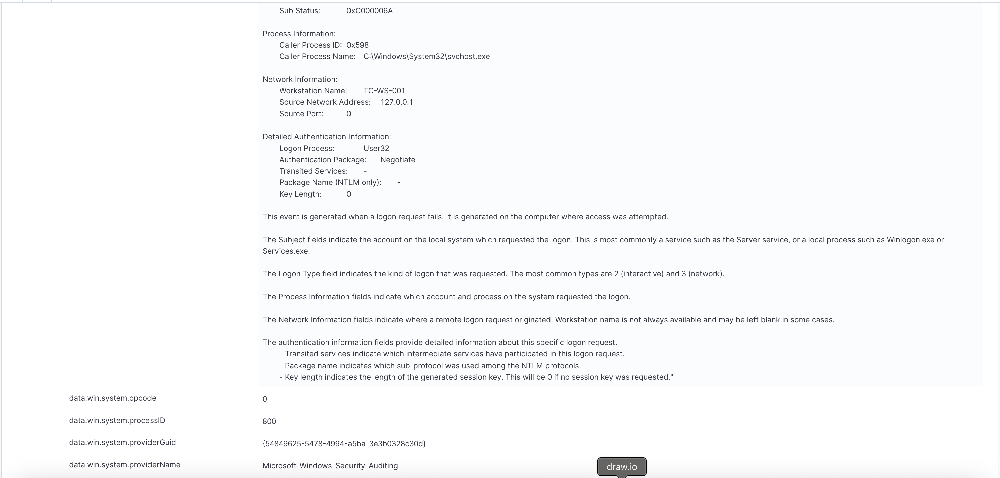
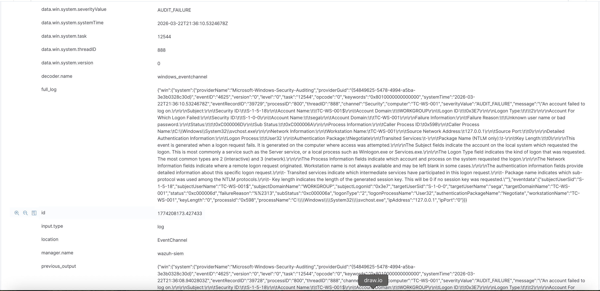
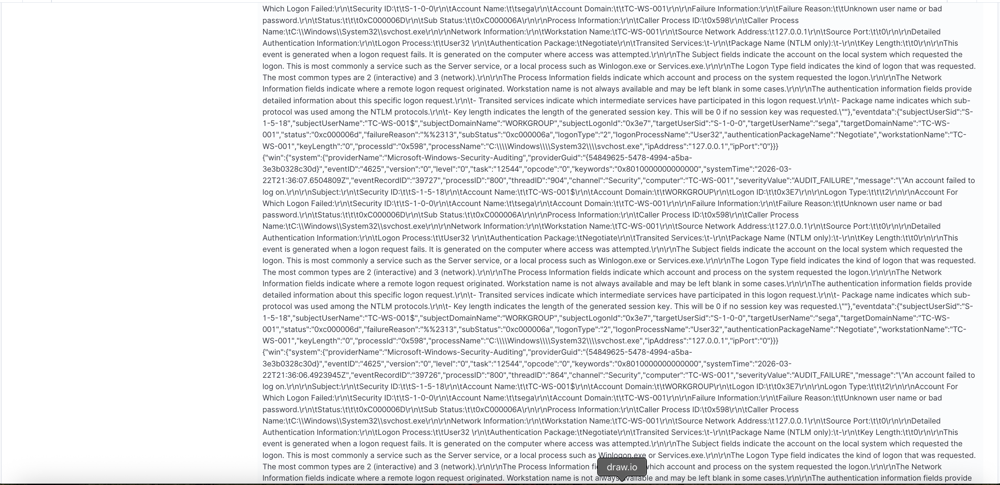
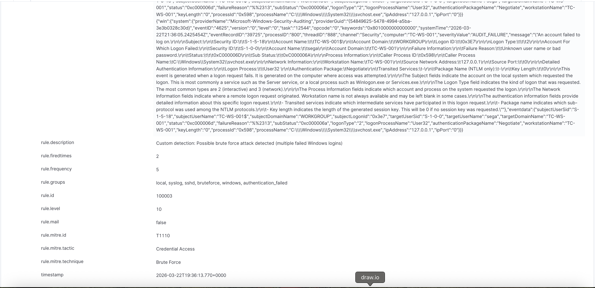

# Incident Report – Brute Force Detection

## 📌 Incident Summary

A brute force attack was detected on the monitored Windows endpoint.  
Multiple failed login attempts triggered a custom Wazuh detection rule (ID: 100003).

- **Alert Level:** 10 (High)
- **Technique:** T1110 – Brute Force
- **Tactic:** Credential Access
- **Target System:** TC-WS-001
- **Account Targeted:** sega

---

## 🚨 Alert Overview

The alert was generated after multiple failed login attempts within a short time period.

---

## 🔍 Detailed Alert Analysis

The alert metadata provides detailed insight into the failed authentication attempts.

### Event Details

---

## 🕒 Timeline of Events

- Initial failed login attempts observed (Event ID 4625)
- Multiple consecutive failures within a short timeframe
- Custom Wazuh rule (ID: 100003) triggered after threshold exceeded
- Alert escalated to high severity (Level 10)

---

## 📊 Key Findings

- Multiple failed login attempts detected (Event ID 4625)
- Logon Type: 2 (Interactive login)
- Source IP: 127.0.0.1 (local machine)
- Authentication package: Negotiate
- Process: `svchost.exe`
- Target account: **sega**

---

## 🧠 Analysis

This activity indicates a brute force attack simulation where repeated failed logins triggered detection.

Since the source IP is localhost:

- The attack was simulated locally
- No external attacker was involved
- This confirms a controlled lab environment

---

## ⚠️ Severity Assessment

- **Risk Level:** High (Level 10 alert)
- **Impact:** Potential unauthorized access if successful
- **Likelihood:** High during testing scenario

---

## ✅ Conclusion

The custom Wazuh rule successfully detected brute force behavior by correlating multiple failed login events.

This demonstrates:

- Effective log monitoring
- Proper detection engineering
- Successful alert correlation
